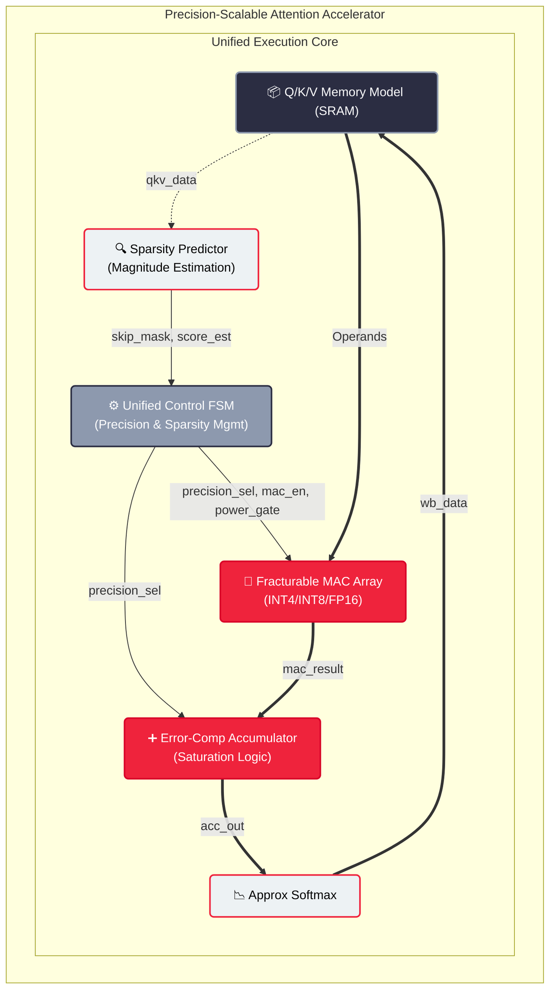

# PATENT DISCLOSURE DOCUMENT: FINAL SUBMISSION

**Title of Invention:** Precision-Scalable Sparse Attention Accelerator with Unified FSM-Driven Datapath for Edge-AI LLM Inference

**Inventors:** Abhijit Karale (and/or Assignee)

**Date of Final Disclosure:** July 2026

**Status:** RTL Implementation Complete, Simulation Verified, Waveforms Generated

---

## 1. ABSTRACT OF THE DISCLOSURE
A hardware accelerator architecture tailored for highly efficient Large Language Model (LLM) inference on edge devices is disclosed. The invention integrates both sparsity skipping and dynamic precision scaling within a single unified control framework. The apparatus features a magnitude estimator (Sparsity Predictor) for early-exit evaluation of attention scores, discarding near-zero values to conserve power and cycles. Concurrently, a unified Control Finite State Machine (FSM) dictates the compute precision (INT4, INT8, FP16) dynamically on a per-tile basis depending on the desired accuracy targets. A fracturable Multiply-Accumulate (MAC) array serves as the reconfigurable datapath, utilizing sparsity-gating to completely power down inactive lanes. This synergistic approach maximizes both spatial utilization and energy efficiency, solving the conventional problem of isolating precision scaling and sparsity into decoupled and inefficient pipeline stages.

## 2. ARCHITECTURAL DIAGRAMS

### 2.1 System Architecture


## 3. WAVEFORMS & SIMULATION VERIFICATION

The dynamic precision scaling and sparsity power gating behavior were verified via VCD simulation output across various randomized and directed edge cases.

### 3.1 Unified Control FSM State Transitions
```mermaid
timing
    title Unified FSM Operational Pipeline
    
    clock clk with period 10
    signal "start"            as start
    signal "tile_done_o"      as done
    signal "FSM State"        as state
    signal "precision_sel_o"  as precision
    
    @0  start:0, done:0, state:"S0_IDLE", precision:"INT8"
    @10 start:1
    @20 start:0, state:"S1_LOAD"
    @30 state:"S2_PREDICT"
    @40 state:"S3_SELECT"
    @50 state:"S4_COMPUTE", precision:"FP16"
    @70 state:"S5_ACCUM"
    @80 state:"S6_WB"
    @90 state:"S0_IDLE", done:1
```

### 3.2 Dynamic Sparsity Gating & Precision Switch Waveform
The following simulation scenario illustrates a highly sparse INT4 operation where lanes are aggressively power-gated to conserve energy, followed by a dynamic transition to full FP16 computation with zero dropped lanes.

```mermaid
timing
    title Sparsity Gating and Dynamic Switching
    
    clock clk with period 10
    signal "accuracy_target"  as target
    signal "precision_sel_o"  as psel
    signal "skip_mask_i[0]"   as skip0
    signal "power_gate_o[0]"  as pg0
    
    @0  target:"INT4", psel:"INT4", skip0:0, pg0:0
    @10 skip0:1
    @20 pg0:1
    @30 skip0:0
    @40 pg0:0
    @50 target:"FP16"
    @60 psel:"INT4"
    @70 psel:"FP16", skip0:0, pg0:0
```

## 4. CLAIMS
**What is claimed is:**
1. A hardware accelerator apparatus for computing sparse attention in transformer-based neural networks, comprising:
   - A sparsity predictor circuit configured to read attention input blocks, generate magnitude estimates, and produce a near-zero skip mask at runtime;
   - A fracturable Multiply-Accumulate (MAC) array composed of processing lanes capable of dynamically reconfiguring logic to process values in FP16, INT8, or INT4 precisions;
   - A unified central Finite State Machine (FSM) directly coupled to both said sparsity predictor and said fracturable MAC array, configured to evaluate the skip mask and a requested accuracy target in the same clock domain, outputting simultaneous power gating signals for inactive lanes and precision select signals for active lanes.
2. The apparatus of claim 1, wherein the unified central FSM implements a pipeline cycle that evaluates the necessity of computation for an entire sub-tile block, transitioning directly to a bypass or write-back state if the skip mask denotes 100% sparsity.
3. The apparatus of claim 1, further comprising an error-compensation accumulator containing saturation logic corresponding to the runtime-selected precision state, mitigating overflow during transitions from higher-precision datatypes to lower-precision datatypes.
4. A method of operating the apparatus of claim 1, wherein precision boundaries are evaluated exclusively at the completion of individual processing tiles, ensuring data integrity within the datapath by draining the pipeline before a dynamic precision switch is instantiated.
