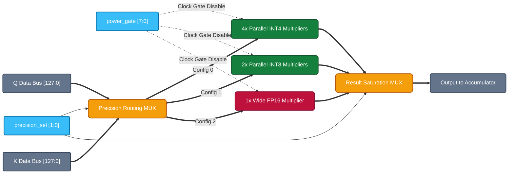

# System Architecture: Precision-Scalable Sparse Attention

## 1. Top-Level Data and Control Flow

The `precision_sparse_attn_top` acts as the overarching wrapper, meticulously designed to separate the data plane from the control plane. This clean separation of concerns is critical for tape-out readiness and minimizing control-path routing congestion in physical synthesis.

```mermaid
flowchart TB
    %% Industry-standard color palette for IP documentation
    classDef memory fill:#1E293B,stroke:#94A3B8,stroke-width:2px,color:#F8FAFC,rx:8px,ry:8px;
    classDef control fill:#0F172A,stroke:#38BDF8,stroke-width:3px,color:#38BDF8,rx:8px,ry:8px;
    classDef datapath fill:#7F1D1D,stroke:#F87171,stroke-width:3px,color:#FEF2F2,rx:8px,ry:8px;
    classDef logic fill:#064E3B,stroke:#34D399,stroke-width:2px,color:#D1FAE5,rx:8px,ry:8px;
    classDef ext fill:#F1F5F9,stroke:#475569,stroke-width:2px,color:#0F172A,stroke-dasharray: 5 5;

    HOST["Host SoC / CPU\n(Configuration)"]:::ext
    QKV["📦 Q/K/V SRAM\n(Memory Subsystem)"]:::memory
    
    subgraph Core["Precision-Scalable Accelerator Core"]
        direction TB
        
        PREDICT["🔍 Sparsity Predictor\n(Magnitude Estimator)"]:::logic
        FSM["⚙️ Unified Control FSM\n(Precision & Sparsity Mgmt)"]:::control
        MAC["🧮 Fracturable MAC Array\n(8-Lane Datapath)"]:::datapath
        ACCUM["➕ Error-Comp Accumulator\n(Saturation Logic)"]:::datapath
        SOFTMAX["📉 Approx Softmax"]:::logic
        
        QKV -.->|Data Stream| PREDICT
        PREDICT -->|Score Estimate\nSkip Mask| FSM
        
        FSM -->|Precision Select (2-bit)\nPower Gate (8-bit)| MAC
        FSM -->|Precision Select| ACCUM
        
        QKV ==>|Operands (Q, K, V)| MAC
        MAC ==>|MAC Result| ACCUM
        ACCUM ==>|Accumulated Out| SOFTMAX
        SOFTMAX ==>|Writeback| QKV
    end

    HOST -.->|accuracy_target\nsparsity_thresh| FSM
```

## 2. Microarchitecture: The Fracturable MAC Array

The defining feature of the compute core is its **fracturability**. Rather than burning area on fixed-function multipliers for every precision, this array dynamically routes data to fracture a wide FP16 multiplier into multiple parallel INT8 or INT4 multipliers based on the `precision_sel` signal from the Unified FSM.

Furthermore, dynamic power is fiercely optimized using the `power_gate` signal. If the Sparsity Predictor determines a lane will operate on a near-zero value, the FSM instantly clock-gates that specific lane, halting combinatorial toggle activity.


