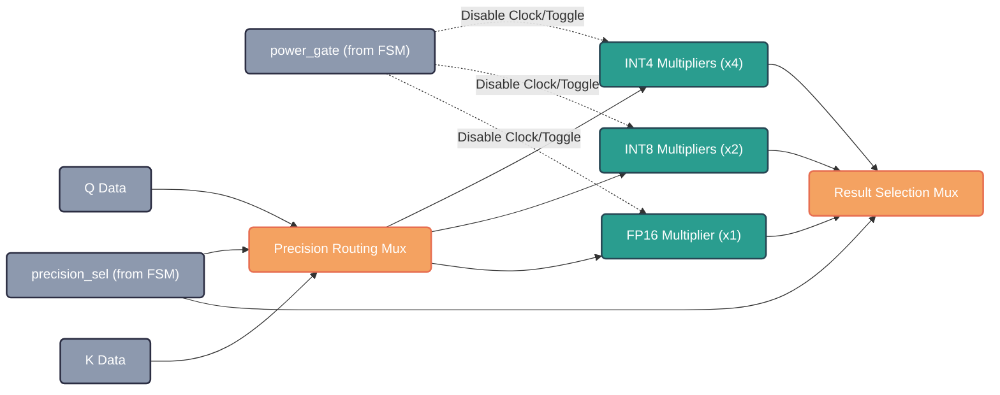

# System Architecture

## Top-Level Data and Control Flow

The `precision_sparse_attn_top` acts as the overarching wrapper connecting the primary modules. The diagram below illustrates how data fetched from the memory model cascades through the Sparsity Predictor and into the Datapath, all tightly orchestrated by the Unified Control FSM.

```mermaid
flowchart TB
    classDef memory fill:#2b2d42,stroke:#8d99ae,stroke-width:2px,color:#fff,rx:5px,ry:5px;
    classDef fsm fill:#8d99ae,stroke:#2b2d42,stroke-width:2px,color:#fff,rx:5px,ry:5px;
    classDef datapath fill:#ef233c,stroke:#d90429,stroke-width:2px,color:#fff,rx:5px,ry:5px;
    classDef logic fill:#edf2f4,stroke:#ef233c,stroke-width:2px,color:#000,rx:5px,ry:5px;

    QKV["📦 Q/K/V SRAM"]:::memory
    
    subgraph Accelerator Core
        PREDICT["🔍 Sparsity Predictor"]:::logic
        FSM["⚙️ Unified Control FSM"]:::fsm
        MAC["🧮 Fracturable MAC Array"]:::datapath
        ACCUM["➕ Error-Comp Accumulator"]:::datapath
        
        QKV -.->|Data Stream| PREDICT
        PREDICT -->|Score Estimate\nSkip Mask| FSM
        
        FSM -->|Precision Select (2-bit)\nPower Gate (8-bit)| MAC
        FSM -->|Precision Select| ACCUM
        
        QKV ==>|Operands (Q, K, V)| MAC
        MAC ==>|MAC Result| ACCUM
        ACCUM ==>|Accumulated Out| QKV
    end
```

## The Fracturable MAC Array

The defining feature of the compute core is its fracturability. Depending on the `precision_sel` signal from the FSM, the internal multipliers either compute high-fidelity FP16 values across their full width, or fracture into multiple parallel INT8/INT4 operations to massively boost throughput and save dynamic power.


