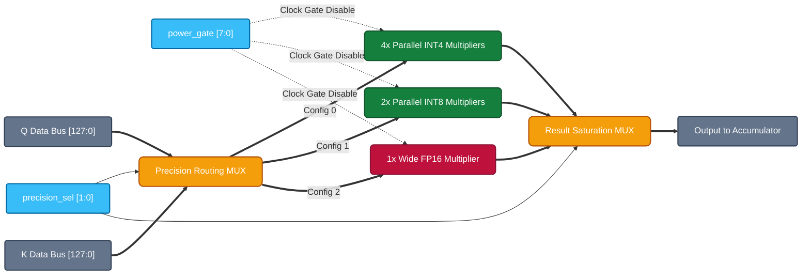

# System Architecture: Precision-Scalable Sparse Attention

## 1. Top-Level Data and Control Flow

The `precision_sparse_attn_top` acts as the overarching wrapper, meticulously designed to separate the data plane from the control plane. This clean separation of concerns is critical for tape-out readiness and minimizing control-path routing congestion in physical synthesis.

```mermaid
flowchart TB
    %% Industry-standard color palette for IP documentation
    classDef memory fill:#1E293B,stroke:#94A3B8,stroke-width:2px,color:#F8FAFC,rx:8px,ry:8px;
    classDef control fill:#0F172A,stroke:#38BDF8,stroke-width:3px,color:#38BDF8,rx:8px,ry:8px;
    classDef datapath fill:#7F1D1D,stroke:#F87171,stroke-width:3px,color:#FEF2F2,rx:8px,ry:8px;
    classDef logic fill:#064E3B,stroke:#34D399,stroke-width:2px,color:#D1FAE5,rx:8px,ry:8px;
    classDef ext fill:#F1F5F9,stroke:#475569,stroke-width:2px,color:#0F172A,stroke-dasharray: 5 5;

    HOST["Host SoC / CPU\n(Configuration)"]:::ext
    QKV["📦 Q/K/V SRAM\n(Memory Subsystem)"]:::memory
    
    subgraph Core["Precision-Scalable Accelerator Core"]
        direction TB
        
        PREDICT["🔍 Sparsity Predictor\n(Magnitude Estimator)"]:::logic
        FSM["⚙️ Unified Control FSM\n(Precision & Sparsity Mgmt)"]:::control
        ROUTER["🔀 Outlier Router\n(Hardware LLM.int8)"]:::logic
        MAC["🧮 Fracturable MAC Array\n(8-Lane Datapath)"]:::datapath
        ACCUM["➕ Error-Comp Accumulator\n(Saturation Logic)"]:::datapath
        SOFTMAX["📉 Approx Softmax"]:::logic
        
        QKV -.->|Data Stream| PREDICT
        PREDICT -->|Score Estimate\nSkip Mask| FSM
        
        FSM -->|Base Precision Select\nPower Gate (8-bit)| ROUTER
        
        QKV ==>|Operands (Q, K, V)| ROUTER
        ROUTER ==>|Final Precision\nRouted Operands| MAC
        ROUTER -.->|Final Precision| ACCUM
        
        QKV ==>|Operands (Q, K, V)| MAC
        MAC ==>|MAC Result| ACCUM
        ACCUM ==>|Accumulated Out| SOFTMAX
        SOFTMAX ==>|Writeback| QKV
    end

    HOST -.->|accuracy_target\nsparsity_thresh| FSM
```

## 2. Microarchitecture: The Fracturable MAC Array

The defining feature of the compute core is its **fracturability**. Rather than burning area on fixed-function multipliers for every precision, this array dynamically routes data to fracture a wide FP16 multiplier into multiple parallel INT8 or INT4 multipliers based on the `precision_sel` signal from the Unified FSM.

Furthermore, dynamic power is fiercely optimized using the `power_gate` signal. If the Sparsity Predictor determines a lane will operate on a near-zero value, the FSM instantly clock-gates that specific lane, halting combinatorial toggle activity.



## 3. Advanced SoC Integration & Memory Hierarchy (Datacenter / Edge-Server Scale)

To support massive LLM parameters, the Precision-Scalable Sparse Attention Accelerator is designed to integrate seamlessly into a modern **Network-on-Chip (NoC)** ecosystem. The architecture employs standard **AXI4 memory-mapped interfaces** with multi-channel DMA engines to ensure the Fracturable MAC Array never starves for data.

### 3.1 Clustered Accelerator Topology (Scale-Out Architecture)

For datacenter-class NPU arrays, multiple Precision-Scalable Cores are clustered together. A unified L2 SRAM cache buffers the Q/K/V tensors, while a central Global Scheduler dispatches tiles to individual cores based on their current FSM idle states.

```mermaid
flowchart TB
    classDef memory fill:#1E293B,stroke:#94A3B8,stroke-width:2px,color:#F8FAFC,rx:8px,ry:8px;
    classDef core fill:#7F1D1D,stroke:#F87171,stroke-width:3px,color:#FEF2F2,rx:8px,ry:8px;
    classDef noc fill:#0F172A,stroke:#38BDF8,stroke-width:3px,color:#38BDF8,rx:8px,ry:8px;
    classDef ctrl fill:#064E3B,stroke:#34D399,stroke-width:2px,color:#D1FAE5,rx:8px,ry:8px;
    
    HBM["High Bandwidth Memory (HBM2e/3)\n[Multi-Terabyte Bandwidth]"]:::memory
    
    NOC{"Ring / Mesh Network-on-Chip (NoC)"}:::noc
    
    L2["Shared L2 SRAM Cache\n(Q/K/V Tensor Buffer)"]:::memory
    SCHED["Global Hardware Scheduler\n(Tile Dispatcher)"]:::ctrl
    
    subgraph CoreCluster["Accelerator Compute Cluster"]
        direction LR
        CORE0["Sparse Attn Core 0\n(FSM + MAC)"]:::core
        CORE1["Sparse Attn Core 1\n(FSM + MAC)"]:::core
        CORE2["Sparse Attn Core 2\n(FSM + MAC)"]:::core
        CORE3["Sparse Attn Core 3\n(FSM + MAC)"]:::core
    end
    
    HBM <==>|AXI4 (1024-bit)| NOC
    NOC <==>|AXI4| L2
    
    L2 -.-> SCHED
    SCHED ==>|Dispatch Tile 0| CORE0
    SCHED ==>|Dispatch Tile 1| CORE1
    SCHED ==>|Dispatch Tile 2| CORE2
    SCHED ==>|Dispatch Tile 3| CORE3
    
    CORE0 ==>|Writeback| L2
    CORE1 ==>|Writeback| L2
```

### 3.2 High-Bandwidth AXI4 Data Fetch Pipeline

The internal data mover utilizes a deeply pipelined AXI4 master interface to pre-fetch memory tiles while the FSM is actively computing the previous tile. This **Double-Buffering** strategy guarantees 100% utilization of the Fracturable MAC Array during dense attention blocks.

```mermaid
sequenceDiagram
    participant HBM as Main Memory (HBM)
    participant AXI as AXI4 DMA Engine
    participant L1 as Local L1 Scratchpad
    participant FSM as Unified Control FSM
    participant MAC as MAC Array
    
    Note over AXI, FSM: Double-Buffering Mechanism
    
    AXI->>HBM: ARVALID (Address Read Tile 0)
    HBM-->>AXI: RVALID (Burst Read Tile 0)
    AXI->>L1: Store Tile 0 (Buffer A)
    
    FSM->>L1: Read Tile 0
    FSM->>MAC: Compute Tile 0
    
    rect rgb(15, 23, 42)
        Note right of AXI: Parallel Pre-fetch during Compute
        AXI->>HBM: ARVALID (Address Read Tile 1)
        HBM-->>AXI: RVALID (Burst Read Tile 1)
        AXI->>L1: Store Tile 1 (Buffer B)
    end
    
    MAC-->>L1: Writeback Tile 0 Result
    
    FSM->>L1: Read Tile 1 (No Stall)
    FSM->>MAC: Compute Tile 1
```


